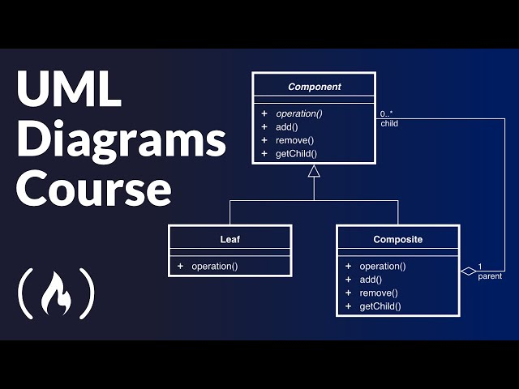

# Unified Modeling Language (UML)

It's a tool which consist in many type of representation for databases or systems. These type of representation are called schemas or most comountly diagrams which helps engineer, software depelover, programmers or anyone (who finds it useful) represent a state, flow or behavior of a part or entire systems.

## Types of diagrams in UML

There two sections which define the types of diagrams in UMl: and inside these we will find the name of these diagrams.

* Structual Diagrams
    1. Composite Structure Diagram
    2. Deployment Diagram
    3. Package Diagram
    4. Profile Diagram
    5. Class Diagram
    6. Object Diagram
    7. Component Diagram

* Behavioral Diagrams
    1. Activity Diagram
    2. Use Case Diagram
    3. State Machine Diagram
    4. Interaction Diagram, which can be:
        1. Sequence Diagram
        2. Communication Diagram
        3. Interaction Overview Diagram
        4. Timing Diagram

## Check all the diagrams and explanation in Freecodecamp Youtube Course

UML Diagrams Full Course (Unified Modeling Language)

